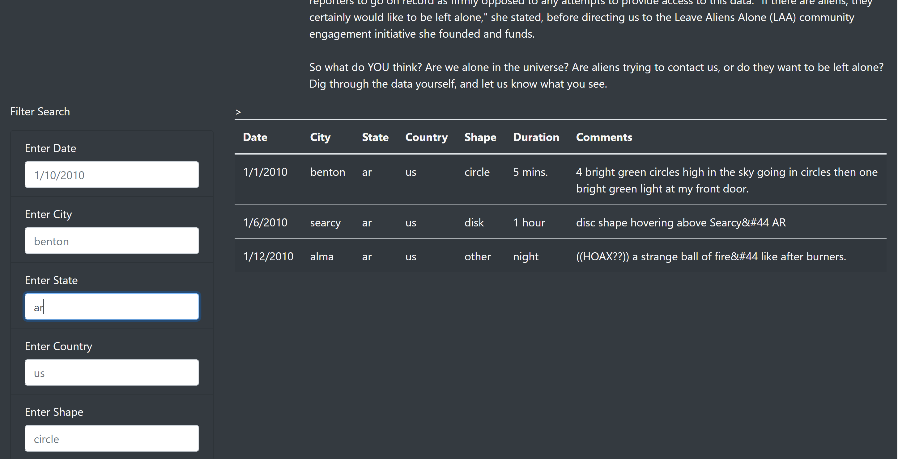
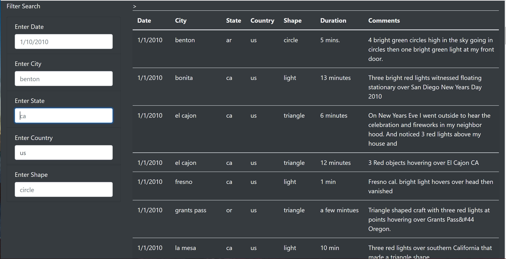
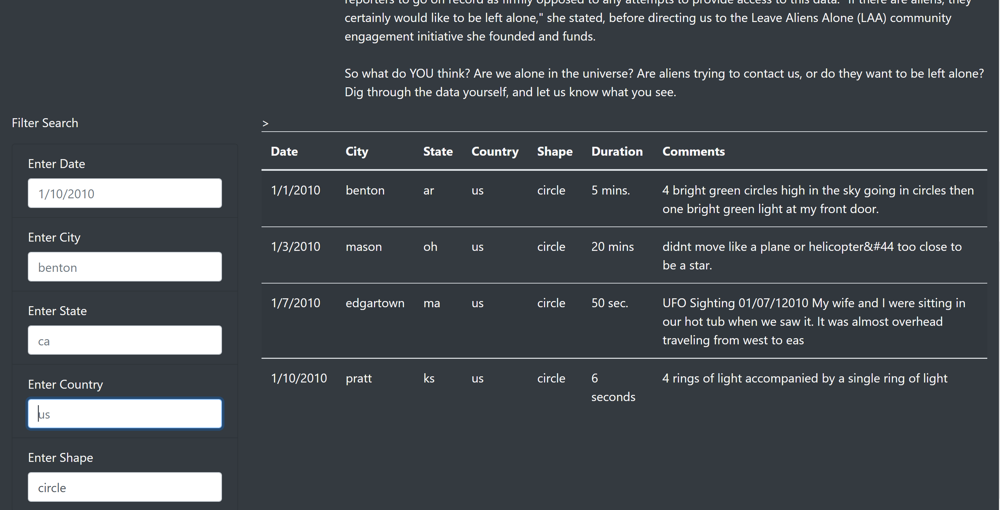

# Module 11 Challenge - Analysis of UFO sightings

## Overview
The purpose of this exercise is to provide an in-depth analysis of UFO sightings by allowing users to filter for multiple criteria at the same time: for example, date, city, country and shape of the UFO.

## Results

It is now possible to use the new webpage to filter on multiple criteria. 

### Filter by Date

As illustrated below we can use the date to filter the results and see the sightings for a specific date. The snapshot below shows the results sorted by date (1/1/2010).

Student Note: Seeing some issues with the filtering. Will resubmit after debugging further.

### Filter by City

As illustrated below we can use the date to filter the results and see the sightings for a specific City. The snapshot below shows the results filtered by a specific city (Benton).

Student Note: Seeing some issues with the filtering. Will resubmit after debugging further.

### Filter by State

As illustrated below we can use the date to filter the results and see the sightings for a specific State. The snapshot below shows the results filtered by a specific State (ca).

Student Note: Seeing some issues with the filtering. Will resubmit after debugging further.

### Filter by Country

As illustrated below we can use the date to filter the results and see the sightings for a specific country. The snapshot below shows the results filtered by a specific country (us)

Student Note: Seeing some issues with the filtering. Will resubmit after debugging further.

### Filter by Shape

As illustrated below we can use the date to filter the results and see the sightings for a specific country. The snapshot below shows the results filtered by a specific shape (circle)

Student Note: Seeing some issues with the filtering. Will resubmit after debugging further.

## Summary

### Drawback of the new design
Once the user scrolls down to the list of results the filter criteria are no longer visible (for example when the user is looking at the bottom of the list).

### Recommendations for further development

- It will be a good enhancement if the user could see the filter criteria selected no matter where we are in the list of the entries.
- To highlight the different columns as well as the heading it would be good to have these in a separate color band; and also if the column headings were always visible regardless of where the user is browsing the list. Perhaps a scrolldown control on the list on this webpage might achieve this.

